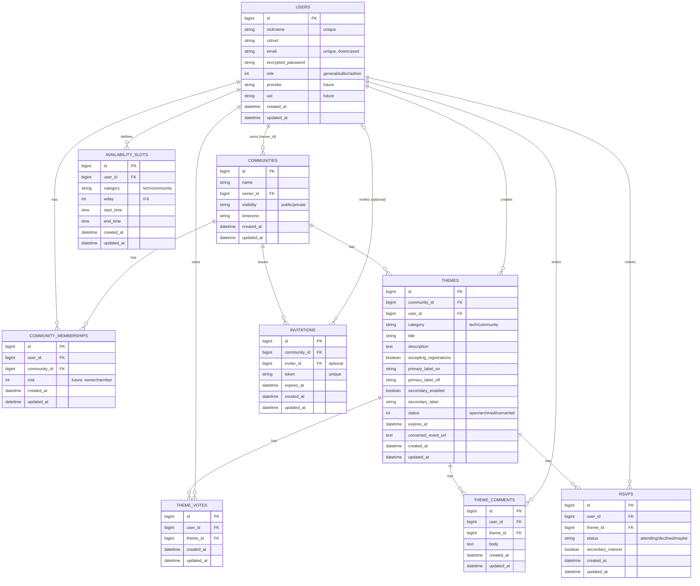

# KikakuHub（README）

## サービス概要
KikakuHub は、イベント主催者が「何をやるか（テーマ）」と「いつやるか（時間帯）」を決めるための企画支援サービスです。
参加者の「やりたいテーマ」と「参加できる時間帯」を集めて可視化し、開催の意思決定を後押しします。

- MVP: RUNTEQ コミュニティ内限定（UIはシングルコミュニティ運用）
- DB設計: 将来の一般公開を見据え、最初からマルチコミュニティ前提

---

## 解決したい課題
イベント開催で詰まりやすいポイントは、当日の運営より前の「テーマ決め」と「時間決め」です。

- 需要があるか分からない
- 何をやればいいか決めきれない
- 日程調整が面倒

KikakuHub はイベント管理をフルで作るのではなく、**開催前の意思決定（企画）** に絞って主催のハードルを下げます。

---

## 想定ユーザー
- 主催者候補（イベントを開きたいがテーマ/日程で止まる学習者）
- 参加者（欲しいテーマを投票・コメントで表明したい学習者）
- コミュニティオーナー（将来: 招待/モデレーション等の運用権限）

用語:
- コミュニティ: サークル、会社、Discord/Slackグループ等の「場」の単位
- オーナー: そのコミュニティの運用責任者（最小権限の管理者）

---

## 利用イメージ（MVP）
1. 参加者がテーマ一覧から投票する（需要の可視化）
2. 参加者がプロフィールで参加可能時間を登録する（週次の時間枠）
3. 主催者候補がテーマ詳細で需要と時間帯の偏りを見て開催判断する
4. 決まったら RUNTEQ公式イベント作成ページへ移動して開催を確定する（MVP）

---

## 差別化ポイント
既存のイベント管理サービスが「日時・参加登録・通知」など開催後工程に寄りがちなのに対し、KikakuHub は **開催前の意思決定** に特化します。

- 投票 + コメントでテーマ需要を集める
- 参加可能時間は個人予定を表示せず、人数集計のみ表示（心理的安全性）
- 集計スコープを分離  
  - トップ: コミュニティ全体の傾向  
  - テーマ詳細: そのテーマで「参加表明」した人だけの傾向

---

## MVPの機能（確定）

### 認証・参加制限
- ユーザー登録/ログイン: **Devise（メールアドレスでログイン）**
- パスワード再設定: Devise標準（recoverable）
- 合言葉による参加制限（MVP）
  - 環境変数 `INVITE_KEY` と照合（DBに保存しない）
  - 将来: 招待リンク（invitations）に置き換え
- 将来: **Google認証**（Devise + OmniAuth などで追加想定）

### テーマ（企画）
- テーマ投稿（カテゴリ、タイトル、概要）
- テーマ一覧/詳細
- 投票（ユーザー×テーマで一意）
- コメント（ユーザー×テーマで複数投稿可）

### 参加表明（主ボタン）+ 第2ボタン（可変）
- 参加状態の切り替え（例: 参加 / 不参加 / 未定）
- 第2ボタン（例: 登壇してみたい / 興味あり / 運営を手伝いたい）
  - テーマ側でラベルを持たせ、出す/出さないを制御
  - registrations 側では `secondary_interest`（ON/OFF）として保持

### 参加可能時間（集計）
- プロフィールで参加可能時間を登録（週次の時間枠）
- 集計表示
  - トップ: コミュニティ全体の偏り
  - テーマ詳細: そのテーマで参加表明したユーザーだけを集計
- カテゴリは **tech / community の2種のみ**（other は採用しない）

### 運用
- テーマのアーカイブ（一定期間で退避し一覧の見通しを保つ）

---

## 画面一覧（MVP）
- トップ：`/`
- ユーザー登録（Devise）：`/users/sign_up`
- ログイン（Devise）：`/users/sign_in`
- ログアウト（Devise）：`DELETE /users/sign_out`
- パスワード再設定（Devise）：`/users/password/new`（申請） / `/users/password/edit`（再設定）

- テーマ一覧：`/themes`
- テーマ作成：`/themes/new`
- テーマ詳細：`/themes/:id`
- アーカイブ一覧：`/themes/archived`

- プロフィール：`/profile`
- 参加可能時間編集：`/profile/availability`

補足:
- MVPはRUNTEQ内限定のため、コミュニティ選択画面は出さない（シングルコミュニティ運用）
- ただしDBはマルチコミュニティ前提で `community_id` を保持する

---

## 画面遷移図

### ユーザー画面（MVP）
```
/ (トップ)
  ├─ /users/sign_up (ユーザー登録)
  │     └─ 登録成功 → / (トップ)
  ├─ /users/sign_in (ログイン)
  │     └─ 成功 → / (トップ)
  ├─ /themes (テーマ一覧)
  │     ├─ /themes/new (テーマ作成)
  │     │     └─ 作成成功 → /themes/:id (テーマ詳細)
  │     ├─ /themes/:id (テーマ詳細)
  │     │     ├─ 投票
  │     │     ├─ コメント
  │     │     ├─ 参加状態切替（主ボタン）
  │     │     ├─ 第2ボタン（secondary_enabled のときのみ）
  │     │     └─ RUNTEQ公式イベント作成ページへ誘導（MVP）
  │     └─ /themes/archived (アーカイブ一覧)
  └─ /profile (プロフィール)
        └─ /profile/availability (参加可能時間登録)
```

### 管理画面（admin / editor）


### users.role（enum）の追加

※ここではコード掲載は省略します（`users.role` は `general / editor / admin` のenumを想定）。
既に `users` に `role` が追加されている前提で、Punditのポリシーにより編集者の権限を制御します。

---

## DB設計（確定方針）

MVPはRUNTEQコミュニティ内運用だが、DBは本リリース（複数コミュニティ）を見据え、マルチコミュニティ前提にする。

### 主要テーブル
- users：ユーザー（Devise + アプリ独自）
- communities：コミュニティ
- memberships：所属（ユーザー×コミュニティ）
- invitations：招待リンク（将来）
- themes：テーマ（企画）
- theme_votes：投票（賛同）
- theme_comments：コメント
- registrations：参加状態 + 第2ボタン状態（ユーザー×テーマ）
- availability_slots：参加可能時間（週次の時間枠）

---


## MVP用 ER図（Mermaid）
```
erDiagram
  USERS ||--o{ MEMBERSHIPS : "has"
  COMMUNITIES ||--o{ MEMBERSHIPS : "has"

  COMMUNITIES ||--o{ THEMES : "has"
  USERS ||--o{ THEMES : "creates"

  THEMES ||--o{ THEME_VOTES : "has"
  USERS ||--o{ THEME_VOTES : "casts"

  USERS ||--o{ AVAILABILITY_SLOTS : "defines"

  USERS {
    bigint id PK
    string nickname "unique"
    string cohort
    string email "unique, downcased"
    string encrypted_password
    datetime created_at
    datetime updated_at
  }

  COMMUNITIES {
    bigint id PK
    string key "unique (e.g. runteq)"
    string name
    datetime created_at
    datetime updated_at
  }

  MEMBERSHIPS {
    bigint id PK
    bigint user_id FK
    bigint community_id FK
    datetime created_at
    datetime updated_at
  }

  THEMES {
    bigint id PK
    bigint community_id FK
    bigint user_id FK "creator"
    string category "tech/community"
    string title
    text description
    datetime created_at
    datetime updated_at
  }

  THEME_VOTES {
    bigint id PK
    bigint user_id FK
    bigint theme_id FK
    datetime created_at
    datetime updated_at
  }

  AVAILABILITY_SLOTS {
    bigint id PK
    bigint user_id FK
    string category "tech/community"
    int wday "0-6"
    time start_time
    time end_time
    datetime created_at
    datetime updated_at
  }
```


## ER図（Mermaid）全体構想




---

## カラム例（抜粋）

### users（例）
- nickname（表示名、ユニーク）
- cohort（期、MVPでは必須）
- email（ユニーク、保存時は小文字化）
- encrypted_password（Devise）
- reset_password_token / reset_password_sent_at（Devise recoverable）
- （将来: provider / uid など Google認証用のカラム追加を想定）

### communities（例）
- name
- owner_id（users参照）
- visibility（public/private）
- timezone

### memberships（例）
- user_id
- community_id
- role（owner/member などは将来拡張。MVPは最小でOK）

### themes（例）
- community_id（必須）
- user_id（作成者）
- category（**tech / community**）
- title / description
- accepting_registrations（主ボタン表示制御）
- primary_label_on / primary_label_off（主ボタン文言）
- secondary_enabled / secondary_label（第2ボタン）
- status（open/archived/converted）
- expires_at（退避基準）
- converted_event_url（任意）

### theme_votes
- user_id, theme_id（組み合わせ一意）

### theme_comments
- user_id, theme_id
- body

### registrations
- user_id, theme_id（組み合わせ一意）
- status（attending/declined/maybe 等）
- secondary_interest（boolean）

### availability_slots
- user_id
- category（**tech / community**）
- wday（0-6）
- start_time / end_time（start < end）

---

## 環境変数
- `INVITE_KEY`: MVPでの合言葉
- `RUNTEQ_EVENT_CREATE_URL`（任意）: RUNTEQ公式イベント作成ページURL（誘導先を固定したい場合）

---

## 開発メモ
- email は小文字化して重複防止
- 参加可能時間は人数集計のみ表示し、個人予定は表示しない
- 参加表明・投票・登録系は「ユーザー×テーマで一意」を基本にして多重登録を防ぐ
- アーカイブで一覧の見通しを保つ
