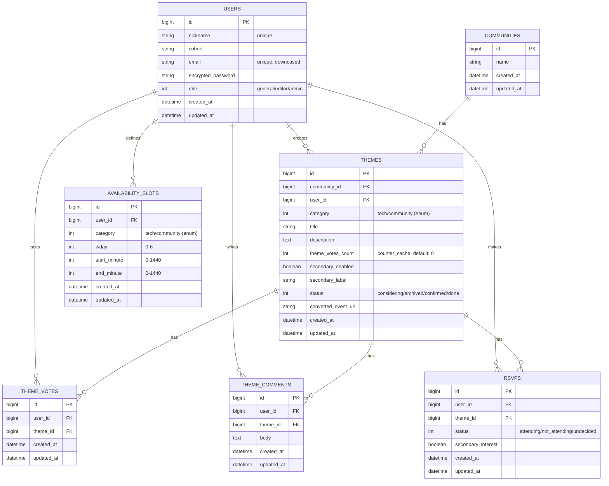

# KikakuHub

> イベント主催者の「**何をやるか（テーマ）**」と「**いつやるか（時間帯）**」を決める企画支援サービス

[](https://www.ruby-lang.org/)
[](https://rubyonrails.org/)
[](https://www.postgresql.org/)

---

## サービス概要

KikakuHub は、イベント開催の「**企画段階**」に特化した支援ツールです。

既存のイベント管理サービスが「日時・参加登録・通知」など開催後の工程に寄りがちなのに対し、KikakuHub は開催前の意思決定に絞ってアプローチします。参加者が「やりたいテーマ」に投票し、参加可能な時間帯を登録することで、主催者候補はテーマの需要と開催しやすい時間帯を一目で把握できます。

- **MVP**: RUNTEQ コミュニティ内限定（シングルコミュニティ運用）
- **DB設計**: 将来の一般公開を見据え、最初からマルチコミュニティ前提

---

## 解決する課題

イベント開催で詰まりやすいのは、当日の運営より前の「テーマ決め」と「時間決め」です。

| 課題 | KikakuHub のアプローチ |
|------|----------------------|
| 需要があるか分からない | テーマへの投票数・参加表明数を可視化 |
| 何をやればいいか決めきれない | 投票・コメントでコミュニティの声を集約 |
| 日程調整が面倒 | 参加可能時間を集計し、候補日時を自動提案 |

---

## 主な機能

### テーマ（企画）管理
- テーマの投稿・一覧・詳細・アーカイブ
- 投票（ユーザー×テーマで1票、counter_cache で集計）
- コメント（Turbo Stream でページリロードなし）
- 参加表明・第2ボタン（テーマ側でラベルを設定可）

### 参加可能時間の集計
- プロフィールで週次の参加可能時間帯を登録
- ホーム: コミュニティ全体の時間帯の偏りを表示
- テーマ詳細: 参加表明したユーザーだけを対象に集計

### 開催しやすさスコア
- テーマごとに 0〜100 のスコアを算出
- 投票数（30%）・参加表明率（30%）・参加可能時間（40%）の加重平均
- スコアをもとに候補日時（TOP3）を自動提案

### 認証・参加制限
- Devise によるメール認証
- 合言葉（環境変数 `INVITE_KEY`）によるコミュニティ参加制限

---

## 技術スタック

| カテゴリ | 技術 |
|---------|------|
| バックエンド | Ruby 3.3.0 / Rails 7.2 |
| データベース | PostgreSQL 16 |
| フロントエンド | Tailwind CSS / daisyUI |
| リアクティブ | Hotwire（Turbo / Stimulus） |
| 認証 | Devise |
| メール | Resend API |
| テスト | RSpec / FactoryBot / Faker |
| コード品質 | RuboCop（omakase）|
| インフラ | Docker / Docker Compose |

---

## 技術的なこだわり

### サービス層による責務の分離

コントローラーの肥大化を防ぐため、ビジネスロジックをサービス層に切り出しています。

```
app/services/
├── availability/
│   ├── aggregate_counts.rb       # 参加可能時間の集計（7日×48スロット）
│   ├── suggest_slots.rb          # 候補日時の自動提案（スライディングウィンドウ）
│   ├── bulk_create_slots.rb      # 複数スロットの一括登録
│   ├── bulk_update_slots.rb      # 複数スロットの一括更新
│   ├── range_merger.rb           # 時間帯の重複マージ
│   ├── weekly_slot_normalizer.rb # 週次スロットの正規化
│   ├── overwrite_copy_category.rb # カテゴリ間コピー
│   └── time_converter.rb         # 分⇔HH:MM 変換
└── themes/
    └── hosting_ease_calculator.rb # 開催しやすさスコア算出
```

各クラスは `.call` クラスメソッドで呼び出す統一インターフェースを採用しています。

### 開催しやすさスコアの算出

3つの指標を正規化・加重平均してスコア（0〜100）を算出します。

```ruby
WEIGHT_VOTES        = 0.3   # 投票数の重み
WEIGHT_RSVP         = 0.3   # 参加表明率の重み
WEIGHT_AVAILABILITY = 0.4   # 参加可能時間の重み（最重要）

score = (normalized_votes * 30) + (normalized_rsvp * 30) + (normalized_availability * 40)
```

| 指標 | 算出方法 | 正規化の上限 |
|------|---------|------------|
| 投票数 | counter_cache の値 | 10票 = 1.0 |
| 参加表明率 | 参加 / 全 RSVP 数 | 100% = 1.0 |
| 参加可能人数 | 自動提案 TOP1 の平均参加人数 | 10人 = 1.0 |

### 候補日時の自動提案（スライディングウィンドウ）

参加可能時間の集計結果（7日×48スロットの2次元配列）から、最もメンバーが集まりやすい時間帯をTOP3で提案します。

- **連続スロット検出**: 最低1時間（2スロット）以上の連続スロットを候補とする
- **スライディングウィンドウ**: 4時間（8スロット）を超えるブロックは、`avg_count` が最大となるウィンドウを選択
- **ソート順**: `avg_count → min_count → スロット数` の優先度で並び替え

### Hotwire によるインタラクション

Turbo と Stimulus を活用し、ページリロードなしの操作性を実現しています。

- **コメント投稿/削除**: Turbo Stream でリストを差分更新
- **投票・RSVP**: Turbo Stream でボタン状態を即時反映
- **参加可能時間の下書き**: sessionStorage に保存し、タブ切替時のデータ消失を防止
- **フラッシュメッセージ**: `AutoDismissController` で5秒後に自動消去

---

## DB設計


```mermaid
erDiagram
  USERS ||--o{ THEMES : "creates"
  USERS ||--o{ THEME_VOTES : "casts"
  USERS ||--o{ THEME_COMMENTS : "writes"
  USERS ||--o{ RSVPS : "makes"
  USERS ||--o{ AVAILABILITY_SLOTS : "defines"
  COMMUNITIES ||--o{ THEMES : "has"
  THEMES ||--o{ THEME_VOTES : "has"
  THEMES ||--o{ THEME_COMMENTS : "has"
  THEMES ||--o{ RSVPS : "has"

  USERS {
    bigint id PK
    string nickname "unique"
    string cohort
    string email "unique, downcased"
    string encrypted_password
    int role "general/editor/admin"
    datetime created_at
    datetime updated_at
  }

  COMMUNITIES {
    bigint id PK
    string name
    datetime created_at
    datetime updated_at
  }

  THEMES {
    bigint id PK
    bigint community_id FK
    bigint user_id FK
    int category "tech/community (enum)"
    string title
    text description
    int theme_votes_count "counter_cache, default: 0"
    boolean secondary_enabled
    string secondary_label
    int status "considering/archived/confirmed/done"
    string converted_event_url
    datetime created_at
    datetime updated_at
  }

  THEME_VOTES {
    bigint id PK
    bigint user_id FK
    bigint theme_id FK
    datetime created_at
    datetime updated_at
  }

  THEME_COMMENTS {
    bigint id PK
    bigint user_id FK
    bigint theme_id FK
    text body
    datetime created_at
    datetime updated_at
  }

  RSVPS {
    bigint id PK
    bigint user_id FK
    bigint theme_id FK
    int status "attending/not_attending/undecided"
    boolean secondary_interest
    datetime created_at
    datetime updated_at
  }

  AVAILABILITY_SLOTS {
    bigint id PK
    bigint user_id FK
    int category "tech/community (enum)"
    int wday "0-6"
    int start_minute "0-1440"
    int end_minute "0-1440"
    datetime created_at
    datetime updated_at
  }
```

### 設計のポイント

- **マルチコミュニティ前提**: MVPはシングル運用だが、`community_id` を保持しスキーマは複数コミュニティに対応
- **時間帯の整数管理**: `start_time/end_time` を分単位の整数で保持し、集計を配列演算で高速化
- **counter_cache**: `themes.theme_votes_count` に集約し投票数取得のN+1を回避
- **ユニーク制約**: `theme_votes`・`rsvps` はDBレベルとモデルの両方で重複を防止

---

## 画面構成

| 画面 | パス | 説明 |
|------|------|------|
| ホーム | `/` | コミュニティ全体の参加可能時間集計・候補日時 |
| テーマ一覧 | `/themes` | 投票数順・カテゴリ・キーワード検索 |
| テーマ詳細 | `/themes/:id` | 投票・コメント・RSVP・開催しやすさスコア |
| テーマ作成 | `/themes/new` | カテゴリ・タイトル・概要・第2ボタン設定 |
| アーカイブ | `/themes/archived` | 終了・確定済みテーマ一覧 |
| プロフィール | `/profile` | ニックネーム・期の確認 |
| 参加可能時間 | `/profile/availability` | 週次の時間帯登録（カテゴリ別・一括更新） |
| マイページ | `/mypage` | 自分のテーマ・投票・RSVP一覧 |

---

## 環境構築

### 必要な環境
- Docker / Docker Compose

### 手順

```bash
# 1. リポジトリのクローン
git clone <repository_url>
cd KikakuHub

# 2. 環境変数の設定
cp .env.example .env
# .env を編集して INVITE_KEY 等を設定

# 3. コンテナの起動
docker compose up -d

# 4. DB の作成・マイグレーション・シードデータ投入
docker compose exec web rails db:setup

# 5. ブラウザで確認
# http://localhost:3000
```

### 主な環境変数

| 変数名 | 説明 |
|--------|------|
| `INVITE_KEY` | コミュニティ参加時の合言葉 |
| `INVITE_KEY_REQUIRED` | 合言葉チェックの有効化 (`true` / `false`) |
| `RESEND_API_KEY` | メール送信用 API キー（Resend） |
| `MAILER_FROM` | 送信元メールアドレス |

---

## テスト

```bash
# 全テスト実行
docker compose exec web bundle exec rspec

# 特定ファイルのみ
docker compose exec web bundle exec rspec spec/services/themes/hosting_ease_calculator_spec.rb
```
